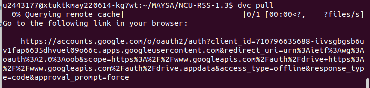
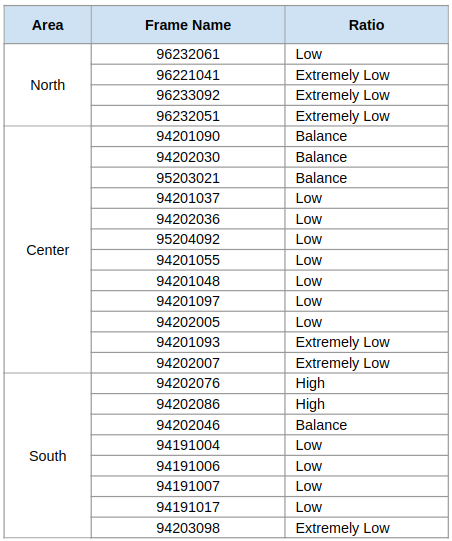
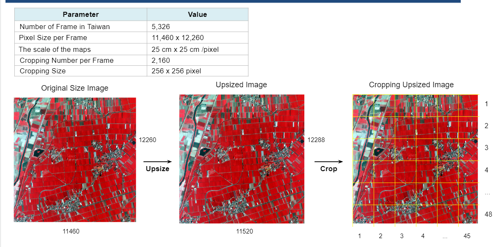
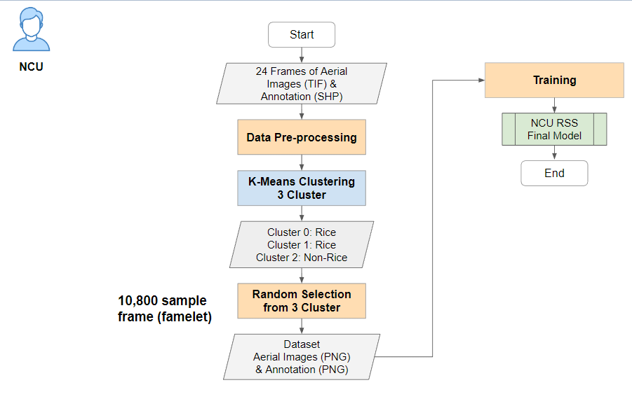
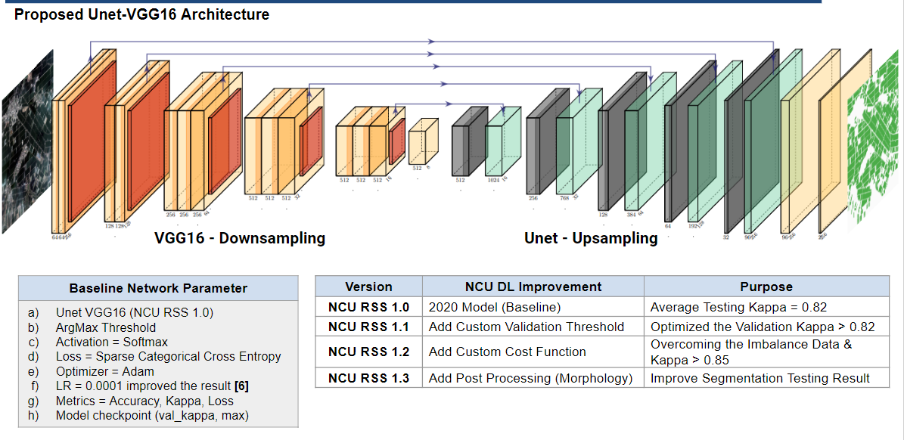
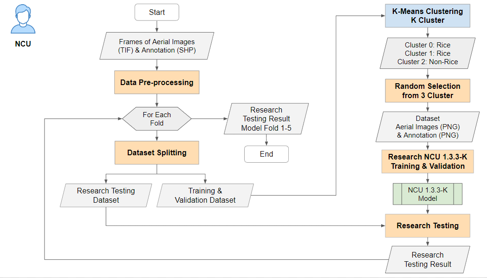
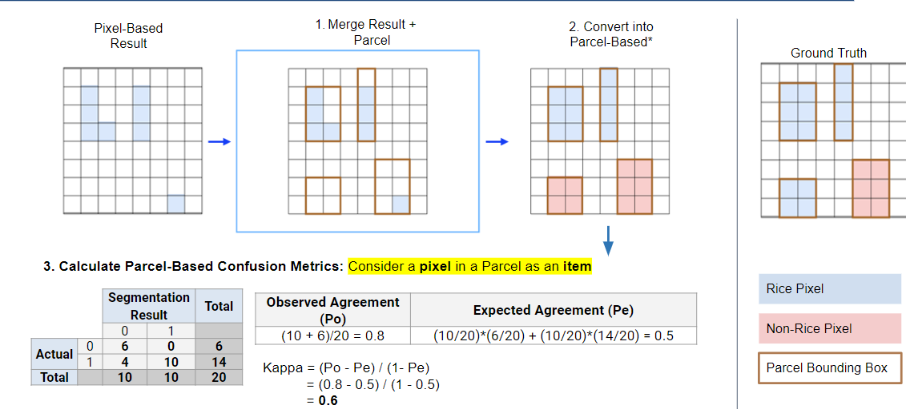
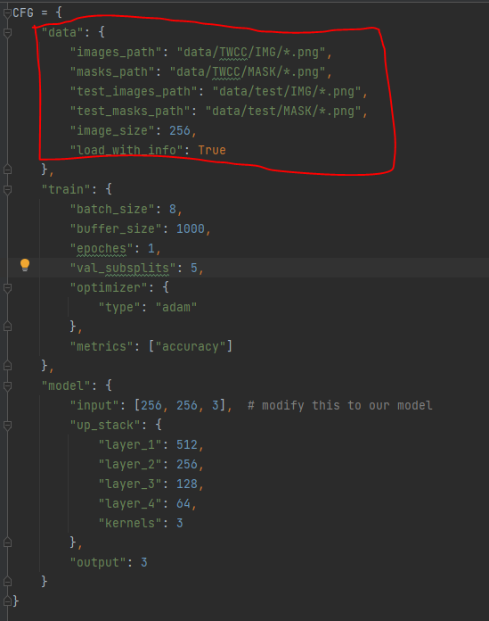

[](https://github.com/ISSLLAB/NCU-RSS-1.3/actions/workflows/python-app.yml)
[](https://github.com/ISSLLAB/NCU-RSS-1.3)

# NCU-RSS-1.3

NCU RSS 1.3 is a deep learning model created to segment rice field in Taiwan. This model was developed using UNet

# Requirement


## Hardware

<details>
<summary>Click to expands! </summary>

This deep learning model was developed using Taiwan Cloud Computing (TWCC) Linux Container with the specification below.
### TWCC
This environment was installed with ubuntu x.xx
* 8 NVIDIA® Tesla V100 GPUs ( 1 GPU, 4 CPU cores, 90 GB memory)
* NVidia Cuda Toolkits installed
### Windows Environment
This project also tested using Windows environment with smaller batch size, and limited computation power, 
For testing purposed. This environment was installed with Windows 10 OS.
* CPU intel i7
* GPU NVidia RTX3080 10GB
* Cuda Toolkit installed

</details>

##Package Dependency
* python 3.8
* pip 22.0
* Tensorflow 2.7
* numpy 1.19
* matplotlib 3.5
* scikit-learn 0.24.0
* opencv-python   4.6
* openpyxl 3.0
* pillow 8.2
* dvc[gdrive]

To automatically install all package please run
```angular2html
$ pip install requirements.txt
```
# Dataset
Here we will explain about the dataset we used, and where it comes from.

<details>
<summary>Click to expands</summary>

The dataset to reproduce the model is available in Google Drive. To get the dataset ready in this code please run this
command below.
```
$ dvc pull
```
This will ask to login into google account and get the verification code. Please use the credential we provide in
xxxx file to login. Then paste the verification code to the terminal. 

The command above will download all images that we used to train the model. The dataset consist of 24 frames from across
region in Taiwan. Below is the list of frames distribution for the training. All frames are cloud free, with clear view.


</details>

## Data Preprocessing
Before the dataset ready to be used we need to some preprocessing. Below is the process how we do the preprocessing.
<details>
<summary>Click to expands</summary>




The frames set come with an image (tif) and a mask (shp file). Then we change the extention to png. then, the frames are
cropped into smaller size (256*256) called framelet. A frame will resulting 2160 framelets. 

After cropping the images, we need to do clustering. The purpose of clustering is to obtain balance class distribution.
We decide to use 3 classes since it yield the best result according the experiment that we have done.
Since we need 5 frames per round, we will need 10800 framelets. And currently we have 3 clusters, therefore we need to 
randomly select 3600 framelets from each cluster. those cropped images will be used to recreate  a frame to feed the 
model. Frame 0 will be used as validation, the rest will be used as training dataset.

Each round will use different combination of frames as training and testing dataset. Therefore we need to repeat 


</details>

# Model
<details>
<summary>Click to expands</summary>


</details>

# Training
<details>
<summary>Click to expands</summary>

The training is done 5 rounds. Each round will used different training and testing dataset. then final model 
will use all frames (24 frames) as training dataset. 

</details>

# Testing
<details>
<summary>Click to expands</summary>


</details>

# How to reproduce the result
<details>
<summary>Click to expands</summary>

To reproduce the model please run the main.py file using the command below

```
python main.py
```
</details>

# Retrain using different dataset
<details>
<summary>Click to expands</summary>

* Add new data in data folder
  
* Change the dataset path in [configs/config.py](configs/config.py)
  
  
* Try to re-run the main.py,
    ```angular2html
    $ python main.py
    ```  
    if the dataset correct it suppose to run normally. If not fix the dataset
* Add the dataset to dvc using 
    ```angular2html
    $ dvc add data
    ```
</details>

# Contribute to the project
<details>
<summary>Click to expands</summary>

If you want to contribute to this project please fork and create pull request.
Make sure that your new proposed feature has a unit testing and pass the testing phase.
Our GitHub Action will check your unit testing and your code style.
If, you have question about this project please contact us through the email below
</details>

[](ncuisslabcoa@gmail.com)

[](https://isslab.csie.ncu.edu.tw/)